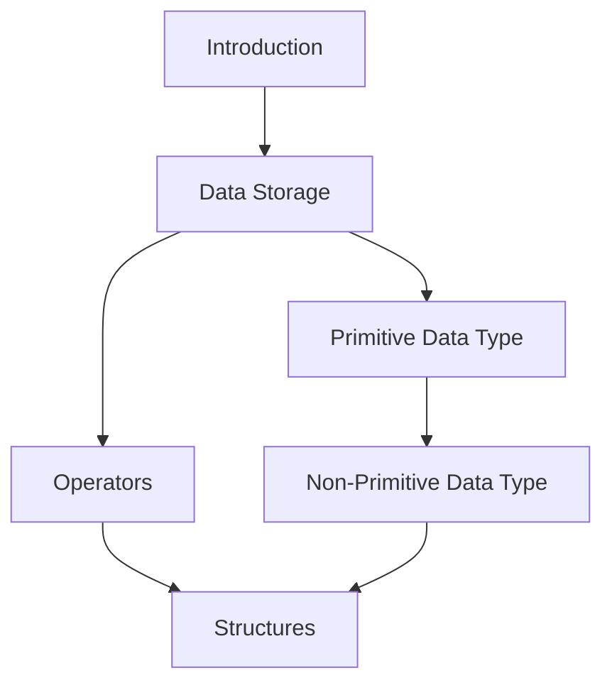

# Course Overview
This course aims to impart the fundamental knowledge required for Software Development that is common across the different programming language.

This course **will not cover any specific programming language** but will employ the use of the **International Baccalaureate’s Pseudo Code notation**. The IB Pseudo Code notation was chosen as it is well defined examinable notation which contains the common elements found in the major programming language in use.

## Target Audience
This course is designed with the following audience in mind:
* Those who wish to have a general understanding of software development
* Those looking to prepare for GCSE O/A Computer Science
* Those looking to prepare for IB Computer Science
* Those looking to prepare for NITEC/Higher NITEC in Technology
* Those looking to prepare for IT related Diplomas

## Required Resources
Computer with internet connection and the following software:
* Visual Studio Code with the following plugin:
* IBCS Pseudocode
* Microsoft Teams

## Course Materials
Course materials will be provided via an online repository.

## Course Objective
At the end of the course, participants will understand the following concepts within software development:

**Primitive Data Type**
* Boolean
* Char
* Byte
* Short
* Int
* Long
* Float
* Double

**Operators**
* Addition
* Subtraction
* Multiplication
* Division
* Modulus
* Evaluation

**Non-Primitive Data Type** 
* String
* Class
* Array

**Control Flow**
* IF
* IF-ELSE
* FOR
* WHILE
* DO-WHILE
* SWITCH

**Structures**
* Functions
* Class

### Course Flow

