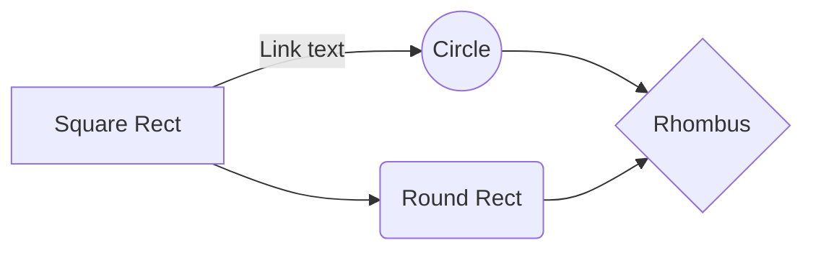

--- 
layout: post 
title: “Mermaid Test”
excerpt: “This is a test of Mermaid JS graph capability.”
comments: false
share: true
mermaid: true
categories: [blog]
tags: [testing,graph]
---

```mermaid

graph LR
    A[Square Rect] -- Link text --> B((Circle))
    A --> C(Round Rect)
    B --> D{Rhombus}
    C --> D

```
