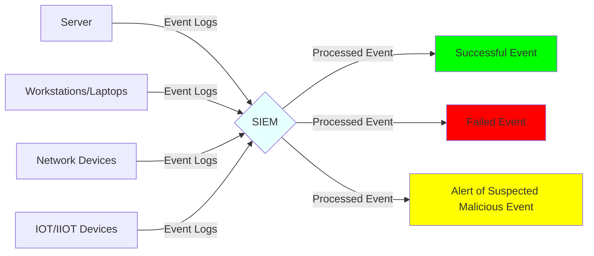

--- 
layout: post 
title: “PySIEM - Introduction to the project”
excerpt: “An introduction to the PySIEM project discussing it's purpose and objectives.”
comments: false
share: true
mermaid: true
categories: [project]
tags: [PySIEM, Python, Cyber Security]
---
# Introduction

One of the best way to study and check your understanding of a subject is to use that knowledge to make something tangible. With that in mind, this project was conceived. 

This project will act as a documentary of my current understanding of the subjects of Software Design, Software Development, Cyber Security Events, and Cyber Security Analysis.

# Background

A Security Information and Event Management or SIEM is a software or system that is widely deployed by organizations big and small. 

SIEMs work by collecting event logs from various endpoints that exists in an organization. Endpoints can be servers, workstations, laptops, network devices and IOT/IIOT devices. Applications running on these endpoints can also generate logs and in turn these logs may be ingested by the SIEM. 

Once the logs of events are ingested by the SIEM, they are processed and events are extracted from them. The events that have been extracted are then analyzed and categorized.

The events can be categorized based on the severity of the event, the type of security event identified, potentially malicious events etc.

SIEMs can also generate alerts based on rules created. These rules check for the existance of events and based on the criteria that has been set, an alert can be sent to the security team.

Some advance SIEMs are also able to create a timeline of related events that can aid in the investigation of a cyber security incident.

# Objective

The objectives of the this project are divided into two categories which are "minimum" objectives and "enhancement" objectives.

The "minimum" objectives delivers basic functioning SIEM and they are as follows.
1. Collect Event Logs from endpoints
2. Process the Event Logs and extract events
3. Categorize the events
4. Make the events searchable

While the "minimum" objective represents the basic functionality that a SIEM should have, the "enhancement" objectives represents enhanced functionality that have come to be expected with a SIEM. 
1. Event timeline
2. Graphing, both traditional graphs and network graphs
3. Alert generation for suspicious/malicious events
4. Integration with CTI sources (SIGMA)

# Planned Tasks 

The project will be broken up into the following phases.
1. Study
2. Research
3. Prototyping
4. Development

In the "Study" phase, the use cases of PySIEM are identified and the main elements and components are laid out.

In the "Research" phase, different approaches and technologies that can be used to develop the components within PySIEM are looked at and compared. This phase also includes studying the different log sources and identifying fields within them than can be used to form an event.

Once an approach or framework has been selected a small prototype will be created in the "Prototyping" phase to test out their suitability and compatibility with other frameworks that have been selected.

Once all the selected approaches and frameworks have been validated, the "Development" phase of PySIEM will begin.

The targeted end date for development of PySIEM with the "minimum" objectives will be August 2022 which will coincide with [GeekcampSG 2021](https://geekcamp.sg) where I plan to do a presentation on PySIEM.

# References

PySIEM is inspired by the work done by Dan Person, [@dogoncouch](https://twitter.com/dogoncouch) namely [LogESP](https://github.com/dogoncouch/LogESP), [logdissect](https://github.com/dogoncouch/logdissect) and [siemstress](https://github.com/dogoncouch/siemstress).
